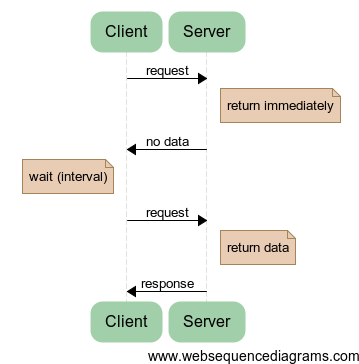
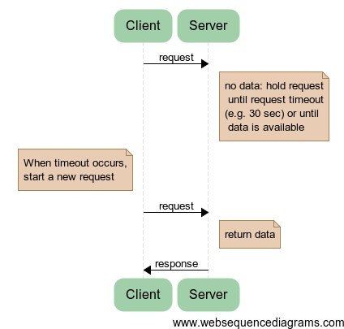
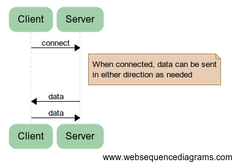
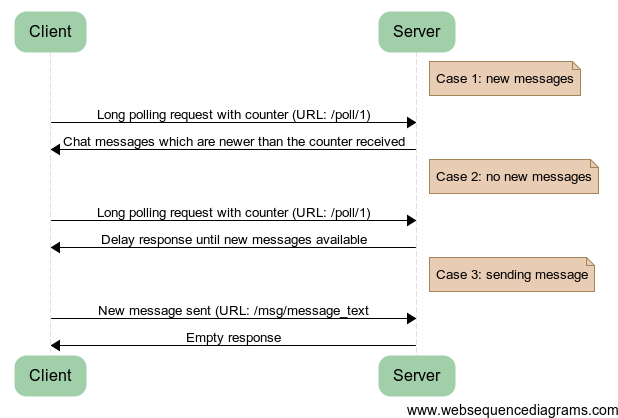

home: index.html
prev: ch2.html
next: ch4.html
---
# 3. Simple messaging application

<div class="summary">
  In this chapter, I:
  <ul>
    <li>specify a simple messaging application that uses long polling</li>
    <li>build a long polling server using Node and</li>
    <li>build a simple messaging client using jQuery</li>
  </ul>
</div>

Let’s jump right in and do something with Node.js. We will be implementing a simple chat-type application using long polling. In our example, we will use simple, manual techniques to get a server up and running quickly. Routing, file serving and error handling are topics which we will expand upon in the later chapters.

<p>Long polling is a simple technique for reading data from a server. The client browser makes a normal request, but the server delays responding if it does not have any new data. Once new information becomes available, it is sent to the client, the client does something with the data and then starts a new long polling request. Thus the client always keeps one long polling request open to the server and gets new data as soon as it is available.

<table>
  <tr><td>Request-response</td><td>Long polling</td><td>Sockets</td></tr>
  <tr><td class="huge"></td><td class="huge"></td><td class="huge"></td></tr>
  <tr><td colspan="3">The difference between request-response (simple polling), long polling and sockets</td></tr>
</table>

<p>To implement long polling, we need two things:

1.  Some sort of data payload. In our case, this will be a chat message.
2.  Some way of knowing which messages are new to our client. In our case, we will use a simple counter to know which messages are new.

The client will be a simple HTML page which uses jQuery to perform the long polling calls, while the server will be a Node.js server.

There are three cases we need to handle:

1.  Case 1: New messages are available when the client polls. The server should check it's message list against the counter received from the client. If the server has messages that are newer than the counter, the server should return those messages up to the current state as well as the current count.
2.  Case 2: No new messages are available when the client polls. The server should store the client request into the list of pending requests, and not respond until a new message arrives.
3.  Case 3: A client sends a new message. The server should parse the message, and add it to the message list and release all pending requests, sending the message to them.

These are illustrated below:



## 3.1 Building a simple server

Let’s start by getting the server to respond to HTTP requests. We will require a number of Node.js libraries:

```js
var http = require('http'),
    url = require('url'),
    fs = require('fs');
```

In addition, we need storage for the messages as well as pending clients:

```js
var messages = [&quot;testing&quot;];
var clients = [];
```

We can create a server using http.createServer(). This function takes a callback function as an argument, and calls it on each request with two parameters: the first parameter is the request, while the second parameter is the response. Refer to [nodejs.org](http://nodejs.org/api) for more information on the [http API](http://nodejs.org/api/http.html). We will get into more detail in the later chapters.

Let’s create a simple server which returns “Hello World”:

```js
http.createServer(function (req, res) {
   res.end("Hello world");
}).listen(8080, 'localhost');
console.log('Server running.');
```

If you run the code above using node server.js, and make a request by pointing your browser to http://localhost:8080/, you will get a page containing “Hello World”.

This is not particularly interesting, however, we have now created our first server. Let’s make the server return a file - which will contain our client code. The main reason for doing this is that browsers enforce a [same-origin policy](http://en.wikipedia.org/wiki/Same_origin_policy) for security reasons which makes long polling complicated unless the client comes from the same URL as we will be using for the long polling.

This can be done using the [FS API](http://nodejs.org/api/fs.html):

```js
http.createServer(function (req, res) {
  fs.readFile('./index.html', function(err, data) {
    res.end(data);
  });
}).listen(8080, 'localhost');
console.log('Server running.');
```

We will read the file using asynchronous function fs.readFile. When it completes, it runs the inner function, which calls res.end() with the content of the file. This allows us to send back the content of the index.html file in the same directory as server.js.

## 3.2 Writing the client

Now that we have the capability to serve a file, let’s write our client code. The client will simply be an HTML page which includes [jQuery](http://en.wikipedia.org/wiki/JQuery) and uses it to perform the long polling requests. We will have a simple page with a single text area, which will contain the messages we have received from the server:

```html
<html>
<head>
  <script src=&quot;http://code.jquery.com/jquery-1.6.4.min.js&quot;></script>
  <script>
  // client code here
  </script>
</head>
<body>
 <textarea id=&quot;output&quot; style=&quot;width: 100%; height: 100%;&quot;>
 </textarea>
</body>
</html>
```

jQuery provides a number of [AJAX functions](http://api.jquery.com/category/ajax/), which allow us to make HTTP requests from the browser. We will use the getJSON() function, which makes a HTTP GET call and parses the resulting data from the JSON format. The first argument is the URL to get, and the second parameter is the function which handles the returned response.

```js
// Client code
var counter = 0;
var poll = function() {
  $.getJSON('/poll/'+counter, function(response) {
     counter = response.count;
     var elem = $('#output');
     elem.text(elem.text() + response.append);
     poll();
  });
}
poll();
```

We maintain a global counter, which starts at zero and is passed to in the URL to the server. The first request will be to /poll/0, with subsequent requests incrementing that counter to keep track of which messages we have already received.

Once the message is received, we update the counter on the client side, append the message text to the textarea with the ID #output, and finally initiate a new long polling request by calling poll() again. To start the polling for the first time, we call poll() at the end of code.

## 3.3 Implementing long-polling on the server side

Now that we have implemented the client, let’s add the code to implement long polling on the server side. Instead of responding to all requests with the contents of index.html, we need to parse the request URL and determine what we want to do.

```js
http.createServer(function (req, res) {
   // parse URL
   var url_parts = url.parse(req.url);
   console.log(url_parts);
   if(url_parts.pathname == '/') {
      // file serving
      fs.readFile('./index.html', function(err, data) {
         res.end(data);
      });
   } else if(url_parts.pathname.substr(0, 5) == '/poll') {
     // polling code here
  }
}).listen(8080, 'localhost');
console.log('Server running.');
```

We are using the url API to parse the request URL, then we refer to the one of the parts of the url, the pathname which corresponds to the part that comes after the server IP/domain name. Since the client polls the “/poll” location, we check whether the first five characters of the pathname match that address before executing the poll code.

The long polling code on the server side is simple.

```js
var count = url_parts.pathname.replace(/[^0-9]*/, '');
console.log(count);
if(messages.length > count) {
  res.end(JSON.stringify( {
    count: messages.length,
    append: messages.slice(count).join(&quot;\n&quot;)+&quot;\n&quot;
  }));
} else {
  clients.push(res);
}
```

We take the URL, and remove all non-numeric characters using a regular expression. This gives us the counter value from the client: “/poll/123” becomes simply “123”. Then we check whether the messages array is longer than the counter value, and if it is, we will immediately return by using Response.end().

Because we are sending data as JSON, we create an object with the "count" and "append" properties and encode it into a string using JSON.stringify. This JSON message contains the current count on the server side (which is the same as messages.length) and all the messages starting from count (using the slice function) joined together (with newlines separating the messages).

If the count is greater than the current number of messages, then we do not do anything. The client request will remain pending, and we will store the Response object into the clients array using push(). Once this is done, our server goes back to waiting for a new message to arrive, while the client request remains open.

## 3.4 Implementing message receiving and broadcasting on the server side

Finally, let’s implement the message receiving functionality on the server side. Messages are received via the HTTP GET requests to the /msg/ path, for example: /msg/Hello%20World. This allows us to skip writing more client code for making these requests (easy, but unnecessary).

```js
} else if(url_parts.pathname.substr(0, 5) == '/msg/') {
  // message receiving
  var msg = unescape(url_parts.pathname.substr(5));
  messages.push(msg);
  while(clients.length > 0) {
    var client = clients.pop();
    client.end(JSON.stringify( {
      count: messages.length,
      append: msg+&quot;\n&quot;
    }));
  }
  res.end();
}
```

We decode the url-encoded message using unescape(), then we push the message to the messages array. After this, we will notify all pending clients by continuously pop()ing the clients array until it is empty. Each pending client request receives the current message. Finally, the pending request is terminated.

## 3.5 Conclusion and further improvements

Try running the code in Node and sending messages using your browser:

*   By navigating to http://localhost:8080/, you can open the client
*   To send messages, simply open http://localhost:8080/msg/Your+message+here, replacing “Your+message+here” with the message you want to send.

If you open several client windows, they will all receive the messages you send.

There are several ways in which this simple server could be improved:

*   First, the messages are not persistent - closing the server empties out the messages array. You could add persistence by writing the messages to a database when they arrive, or even more simply by using setInterval to save the messages to a file. You will then need to load the messages from the file when the server is restarted.
*   Second, the client is extremely simple: it does not do anything with the messages themselves. You could implement an improved interface for displaying the messages by writing client-side Javascript that dynamically adds the new messages to a list. If you want to implement more complicated functionality, then the message format should be improved with new functionality, such as the name of the user that sent the message.
*   Third, the server-side could be improved with additional functionality such as support for multiple channels and user nicknames. These are best implemented as separate classes, such as a Channel class and a User class. You will learn about implementing classes using prototypal inheritance in the chapter on Objects, and we will cover more Node.js functionality in the subsequent chapters. We will also go further with this type of application in the later section of the book, where we discuss Comet applications.

For now, this brief example should give you a basic understanding of how a long polling Node.js HTTP server can be implemented, and how you can respond to client requests. After covering some more fundamental techniques, we will cover more advanced ways of structuring your code that help you in writing more complex applications.
